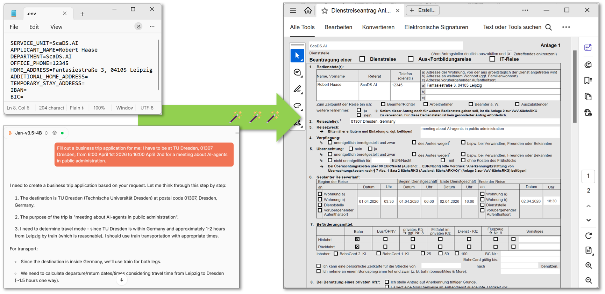

# Dienstreiseantrag Model Context Protocol (DRA-MCP)

A model context protocol server for filling out business trip application forms.



Note that DRA-MCP is in early stage of development. It may later be used in production and for teaching. Hence, suggestions and improvements are welcome, as long as we don't over-engineer it.

## Setup

It is recommended to install [uv](https://docs.astral.sh/uv/) first.

```
git clone https://github.com/scads/dra-mcp
cd dra-mcp
uv sync
```

Put reusable applicant details in `.env`:
```
SERVICE_UNIT=
APPLICANT_NAME=
DEPARTMENT=
OFFICE_PHONE=
HOME_ADDRESS=
ADDITIONAL_HOME_ADDRESS=
TEMPORARY_STAY_ADDRESS=
IBAN=
BIC=
BANK_NAME=
```
This file is ignored by Git because it may contain personal and banking information.

If you use this tool via an MCP-compatible AI-agent such as [Jan.AI](https://github.com/janhq/jan) (open source), it is recommended to use privacy-preserving, local-only Large Language Models. If you use a cloud-service for this, be aware that information such as your home adress and bank account might be shared with this cloud service provider!

## Use

```powershell
python business_trip.py --help
python business_trip.py `
  --application-kind business-trip `
  --destination "Dresden" `
  --purpose "Project meeting" `
  --departure-date 2026-10-12 `
  --outbound-train `
  --return-train `
  --output completed-trip.pdf
```

The CLI accepts options for all applicant-editable text fields, choices, and checkboxes. Omitted fields stay blank in the PDF. Boolean options support both `--option` and `--no-option`; radio choices are listed by `--help`.

The same function can be called from Python:

```python
from business_trip import create_business_trip_application

create_business_trip_application(
    "completed-trip.pdf",
    destination="Dresden",
    purpose="Project meeting",
    outbound_train=True,
)
```

## MCP server

`business_trip_mcp_server.py` exposes `create_business_trip_application` as an MCP
tool via [FastMCP](https://gofastmcp.com), so an MCP-compatible AI agent can fill
out and generate the PDF for you. It also ships a
`business_trip_travel_planning_guide` prompt with detailed rules for choosing the
transport mode (train vs. flight) and estimating realistic departure/return
dates and times, assuming the traveller starts from Leipzig.

Install dependencies and run the server with [uv](https://docs.astral.sh/uv/):

```powershell
uv sync
uv run python business_trip_mcp_server.py
```

Point your MCP-compatible client (e.g. [Jan.AI](https://github.com/janhq/jan)) at
this command (`uv run python business_trip_mcp_server.py`, working directory
`dra-mcp`) to add it as a stdio MCP server. Most clients (Jan.AI, Claude Desktop,
VS Code, ...) accept a JSON config such as:

```json
{
  "mcpServers": {
    "dra": {
      "active": true,
      "args": [
        "--directory",
        "path/to/dra-mcp",
        "run",
        "business_trip_mcp_server.py"
      ],
      "command": "uv"
    }
  }
}
```

Adjust `cwd` to wherever you cloned this repository.

## Contributing

Contributions are welcome! Please feel free to submit a Pull Request. Note: Large parts of the code in this repository were vibe-coded using GitHub Copilot integration in Visual Studio Code. When modifying code here, consider using a similar tool.

## Acknowledgements

We acknowledge the financial support by the Federal Ministry of Research, Technology and Space of Germany and by Sächsische Staatsministerium für Wissenschaft, Kultur und Tourismus in the programme Center of Excellence for AI-research „Center for Scalable Data Analytics and Artificial Intelligence Dresden/Leipzig“, project identification number: ScaDS.AI

